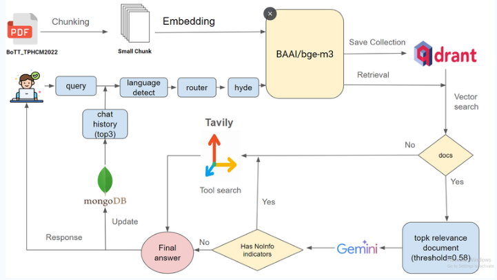
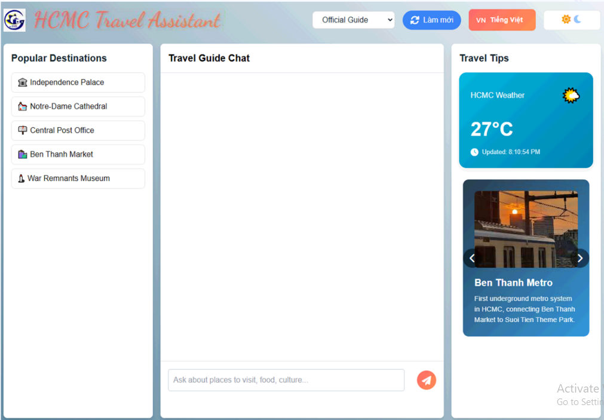

# Rag_travel

## Project Description

Rag_travel is a chatbot application designed to assist users with travel-related queries specifically for Ho Chi Minh City. It leverages a Retrieval-Augmented Generation (RAG) model to provide accurate and context-aware responses.

## Features

- Answer travel-related questions about Ho Chi Minh City
- Provide recommendations for destinations within the city
- English And Vietnamese Language Support

## System Overview



## Demo

Here are some screenshots of the application in action:

### Home Page



## Installation

To install and run the project locally, follow these steps:

1. Clone the repository:
   ```bash
   git clone https://github.com/BaoQuoc285/Rag_travel.git
   ```
2. Navigate to the project directory:
   ```bash
   cd Rag_travel
   ```
3. Set up a virtual environment and install dependencies:
   ```bash
   python -m venv env
   source env/bin/activate
   pip install -r requirements.txt
   ```
4. Start the application:
   ```bash
   cd rag_controller
   python test.py
   ```

## Usage

1. Open the application in your browser.
2. Start asking travel-related questions about Ho Chi Minh City.

## API Endpoints

The application provides several API endpoints for various functionalities. Below are some key endpoints:

### Root Endpoint

- **URL:** `/`
- **Method:** `GET`
- **Description:** Loads the main page and initializes a session.

### Query Endpoint

- **URL:** `/query`
- **Method:** `POST`
- **Description:** Processes user queries and returns relevant information.
- **Request Body:**
  ```json
  {
    "question": "Your question here"
  }
  ```

### Weather API Endpoint

- **URL:** `/api/weather`
- **Method:** `GET`
- **Description:** Fetches the current weather information for Ho Chi Minh City.

### Change Collection Endpoint

- **URL:** `/change-collection`
- **Method:** `POST`
- **Description:** Changes the current collection used for querying.
- **Request Body:**
  ```json
  {
    "collection": "collection_name"
  }
  ```

## Contributing

We welcome contributions to improve this project. If you have suggestions or improvements, please create a pull request. For major changes, please open an issue first to discuss what you would like to change.

1. Fork the repository.
2. Create a new branch (`git checkout -b feature-branch`).
3. Make your changes.
4. Commit your changes (`git commit -m 'Add some feature'`).
5. Push to the branch (`git push origin feature-branch`).
6. Open a pull request.

Thank you for your contributions!
